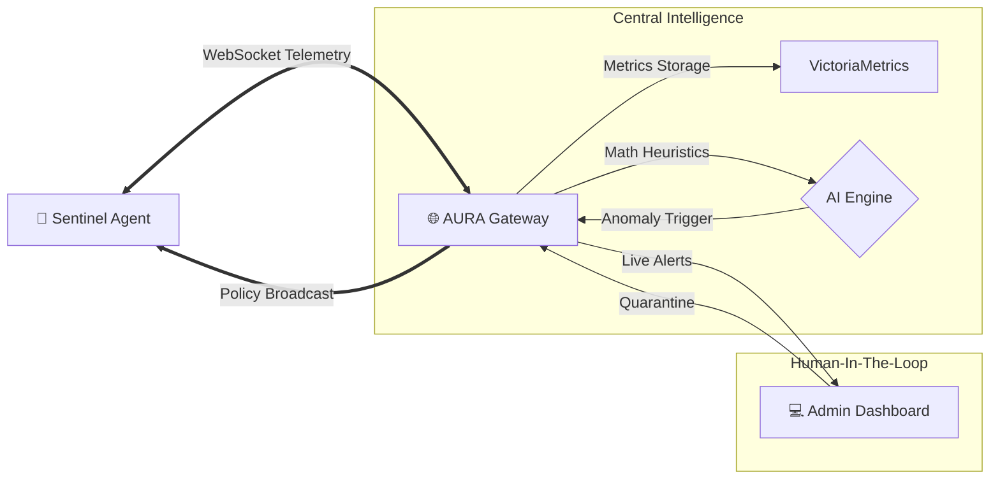

# AURA v3.0: The "Hive Mind"

<div align="center">


**Real-Time AI Telemetry. Active Deep-Freeze Containment. Zero-Trust LAN.**

</div>

---

## ⚡ Overview

AURA relies on the **Sentinel Agent**, a next-generation lightweight security agent designed for ultimate enterprise portability and mathematical precision. 

With the **v3.0** upgrade, AURA has shifted from a basic passive logging tool into an interconnected **Hive Mind** orchestrator. Agents stream telemetry over raw WebSockets to the Central Gateway, where an AI Engine executes Anomaly Detection. When advanced ransomware or anomalous behavior is flagged, the Gateway autonomously broadcasts a `suspend_process` network mandate, safely freezing the attack in RAM before it can act. 

## 🚀 Key Features

### 🧠 The Anomaly AI Engine
-   **Isolation Forest Heuristics**: The Gateway mathematically analyzes telemetry streams for anomalies (`anomalous_score > 0.85`).
-   **Autonomous Safety Nets**: If an endpoint is compromised, the AI doesn't wait. It globally freezes the localized threat context in RAM instantly and drops an Alert into the UI.

### 🛡️ Active-Response "Quarantine & Kill"
-   **Deep Freeze Architecture**: AURA natively uses OS-level handles (`p.Suspend()`) to halt malicious process execution threads. The virus is trapped in memory—unable to encrypt files, but surviving for forensic analysis.
-   **Forensic Snapshots**: If the Admin opts to "Kill", the Agent extracts the raw malware binary `.exe` payload from RAM, dumps it to a local `./quarantine/` lockbox for reverse-engineering, and executes a `SIGKILL` termination.
-   **Hardware Whitelists**: The Agent protects its own execution environment. Terminal chains containing `agent.exe` and `gateway.exe` are mathematically excluded from AI freezing loops to prevent system bricking.

### 📊 Human-in-the-Loop (HITL) Dashboard
-   **Interactive Websockets**: All `ai_alerts` are pumped into an active-response HTML dashboard.
-   **False-Positive Reversals**: A massive **[IGNORE (RESUME)]** button allows Administrators to review a frozen threat. Clicking it broadcasts a thaw order, effortlessly dropping the legitimate application back into standard execution without data loss!
-   **Big Data Observability**: Driven by **VictoriaMetrics**, allowing O(1) time-series tracking of Agent memory overhead, Goroutine efficiency, and event load.

---

## 🛠️ Quick Start

### 1. Launch the Time-Series Brain
You must have Docker running to support the backend VictoriaMetrics storage cluster.
```bash
docker-compose up -d
```

### 2. Launch the Gateway Dashboard
The gateway is the Central Brain and Dashboard server.
```bash
go run ./cmd/gateway
```
Go to **[http://localhost:8080](http://localhost:8080)**.

### 3. Start the Agent
*(Requires Admin Privileges for Process Handle manipulations)*
```bash
go run ./cmd/agent
```

### 4. Verify AI Containment
1. Open the dashboard in your browser.
2. Click **MOCK THREAT DETECTED!** on the top menu bar.
3. The Gateway will inject a simulated zero-day Ransomware detection event.
4. Watch the Sentinel Agent intercept the WebSockets push, drop process isolation logic, and the UI populate with the Review Card!

---

## 🏗️ Architecture


