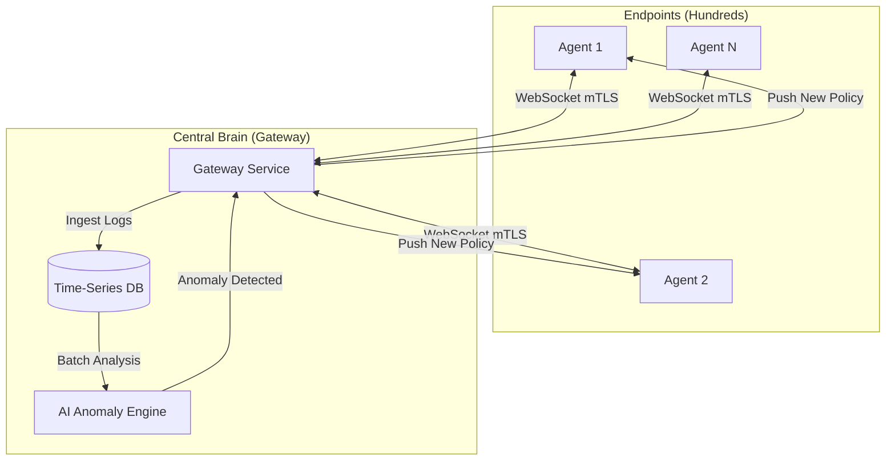

# Sentinel Project Roadmap: From Config to Hive Mind

## 1. Current State: v2.0 (Portable Sentinel)
**Status**: COMPLETE ✅

-   **Architecture**: Standalone, Single Binary.
-   **Data**: Local SQLite (`events.db`).
-   **Policy**: Local `policies.yaml` (Pull/Hot-Reload).
-   **Network**: One-way HTTP Telemetry (Agent -> Gateway).

---

## 2. Future Vision: v3.0 (The "Hive Mind")
**Goal**: Centralized Command & Control with AI-driven Active Response.
**Constraint**: **100% On-Premise / LAN Only**. Must work in air-gapped environments without Internet.

### Architecture Diagram



### Key Changes
1.  **Communication**: `HTTP POST` (Polling) $\rightarrow$ `WebSockets` (Persistent/Real-Time).
2.  **Storage**: `In-Memory` $\rightarrow$ `PostgreSQL` or `ClickHouse` (Persistent/Big Data).
3.  **Intelligence**: `None` $\rightarrow$ `AI/ML Engine` (Anomaly Detection).
4.  **Control**: `Local Config` $\rightarrow$ `Remote Push` (Centralized Management).

---

## 3. Implementation Guide ("How-To")

### A. Centralized Storage (PostgreSQL)
**Why**: We need to store millions of events for the AI to learn from.
**Schema Suggestion**:
```sql
CREATE TABLE events (
    id SERIAL PRIMARY KEY,
    agent_id UUID,
    timestamp TIMESTAMPTZ,
    type VARCHAR(50),
    payload JSONB,
    severity VARCHAR(20)
);

CREATE INDEX idx_agent_time ON events (agent_id, timestamp DESC);
```
**Go Implementation**: Use `pgx` driver for high performance.

### B. Real-Time Comms (WebSockets)
**Why**: To push policies *instantly* when a threat is found.
**Network**: LAN-Only. No Cloud.
**Discovery**:
-   **mDNS / Bonjour**: Zero-conf discovery of Gateway on LAN.
-   **Static IP**: Fallback config `gateway_url = "ws://192.168.1.50:8080"`.

**Protocol**:
-   **Agent connects**: `ws://gateway-local/stream?agent_id=xyz`
-   **Gateway sends**:
    ```json
    {
      "type": "policy_update",
      "policy": { "id": "block-ransomware-v1", "rules": [...] }
    }
    ```
-   **Agent handles**: Overwrites internal policy engine state immediately.

### C. The AI Engine (Lightweight Anomaly Detection)
**Start Simple**: Don't need TensorFlow yet.
**Algorithm**: **Isolation Forest** or **Z-Score** on frequency.

**Logic**:
1.  **Baseline**: "Subject A usually runs `chrome.exe` and `code.exe`."
2.  **Detection**: "Subject A suddenly ran `powershell.exe -enc ...` at 3 AM."
3.  **Action**:
    -   Gateway marks this as `anomaly_score: 0.9`.
    -   If score > 0.8: Auto-generate policy to **SUSPEND** that PID.

### D. Active Response Loop
**The "Kill Switch"**:
1.  AI Flags `agent_123` as compromised.
2.  Gateway looks up `agent_123` active socket.
3.  Gateway sends `Cmd: "ISOLATE_HOST"`.
4.  Agent receives command -> Drops all network connections (via Windows Filtering Platform or Firewall CMD) except Gateway connection.

---

## 4. Immediate Next Steps
1.  [ ] **Gateway DB**: Spin up a Docker container with Postgres. Connect Gateway.
2.  [ ] **Switch to WS**: Refactor `service.go` to maintain a WebSocket connection instead of `http.Client`.
3.  [ ] **Hello World Push**: Make the Gateway send a "Ping" packet that the Agent logs.
